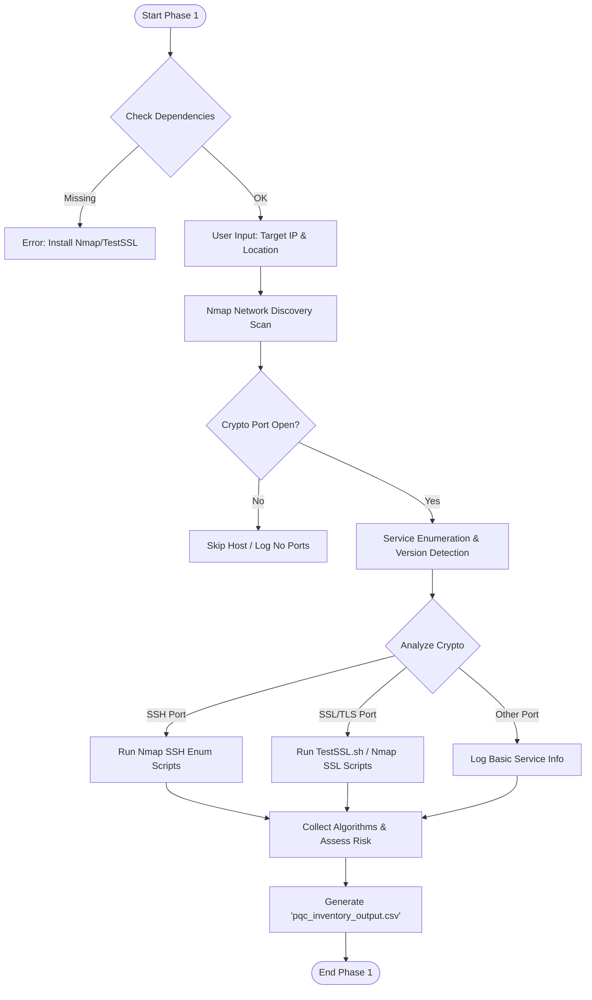

# 🛡️ Phase 1: Discovery & Inventory

> Automated inventory scanning tool to detect exposed crypto-enabled services and assess migration readiness.

---

## 📡 Introduction

Phase 1 uses an **"Outside-In"** approach. Before diving into source code or kernel configs, we first discover what is externally exposed. This phase identifies open network interfaces and the cryptographic protocols they are using.

This initial inventory forms the foundation for all subsequent phases of migration or security assessment.

---

## 🔄 The Methodology (How It Works)

Phase 1 uses a structured, step-by-step discovery flow to minimize blind spots and ensure accuracy.

---

### **1. Target Acquisition**

You tell the tool where to look:

- A **single IP** (e.g., a server or appliance), or  
- A **subnet range** (e.g., an entire VLAN)

You also assign a **Location/Owner tag** (e.g., “Server Room A”), which helps link assets to physical or logical context in later reporting.

---

### **2. Port Discovery**

Using Nmap, the tool scans specifically for ports associated with cryptographic services (“crypto-heavy ports”):

| Port | Purpose | Notes |
|------|---------|-------|
| **22** | SSH | KEX & host key algorithms |
| **443 / 8443** | HTTPS/TLS | Cipher suites & protocol versions |
| **3389** | RDP | Known for legacy crypto |
| **636** | LDAPS | TLS handshake |
| **993 / 995** | Secure IMAP/POP3 | TLS handshake |

The objective isn’t to discover every port —  
it’s to discover **crypto-relevant ports** that play a role in PQC migration.

---

### **3. Service Enumeration**

Once a crypto-relevant port is found, the script extracts:

- Service name (e.g., `ssh`, `https`, `ms-wbt-server`)
- Software version (e.g., `OpenSSH 8.9p1`, `Apache 2.4.52`)
- Protocol type (SSH, TLS/SSL, RDP, etc.)

This version fingerprint is critical because older versions often indicate deprecated or weak algorithm usage.

---

### **4. Active Interrogation (Handshake Stage)**

This step reveals **what cryptography the service actually uses**, not just what it claims in its banner.

#### **For SSH Services**
The scanner collects:

- Key Exchange (KEX) algorithms  
- Host key types (RSA, ECDSA, ED25519)  
- Supported ciphers and MACs  

SSH enumeration helps identify:

- Legacy RSA-only systems  
- Outdated MACs such as SHA1  
- Hosts lacking modern crypto-agility  

#### **For TLS/SSL Services**
If `testssl.sh` is available, a real handshake is performed to identify:

- TLS versions (TLS 1.0 → TLS 1.3)  
- Supported cipher suites  
- Presence of strong or weak primitives:
  - AES-GCM  
  - ChaCha20  
  - ECDHE  
  - Deprecated: RC4, 3DES, MD5  

If TestSSL is missing, the scanner falls back to Nmap’s SSL scripts.

---

### **5. Migration Readiness Grading**

Each service receives a preliminary PQC-readiness rating:

| Level | Meaning | Indicators |
|-------|---------|------------|
| **High** | Good posture | TLS 1.3, ED25519, modern OpenSSH |
| **Medium** | Acceptable | TLS 1.2, RSA/ECDHE |
| **Low** | Needs attention | RC4, SSLv3, SHA1, outdated SSH |

This helps prioritize which systems need deeper analysis.

---

## 📈 Process Flowchart

## 📊 Data Dictionary: What the Data Means

The tool generates a CSV file (`pqc_inventory_output.csv`) that can be directly used for initial inventory.  
Below is the description of each column:

| Column Name                   | Description |
|--------------------------------|-------------|
| **Asset Type**                 | Type of asset (e.g., Application Stack, Operating System). The scanner infers this from the port scanned (e.g., Port 22 → OS/Application). |
| **Asset Name / Identifier**    | Unique ID for the asset. Combines IP Address, Service Name, and Software Version. Example: `10.55.2.7 - ssh (OpenSSH 8.9p1 Ubuntu)` |
| **Location / Owner**           | Physical location of the asset (e.g., "Server Room A"). Provided by the user during scan. |
| **Cryptographic Functionality Present?** | Yes/No. Since the tool only scans crypto-enabled ports (22, 443, etc.), this is usually "Yes". |
| **Examples of Algorithms Used** | Cryptographic algorithms detected during handshake. Example: RSA, ECDHE, AES-GCM. |
| **SBOM/CBOM Available?**       | Default `No`. Indicates whether a deeper SBOM/CBOM scan has been done (Phase 2). |
| **Migration Readiness Level**  | Automated assessment of migration readiness (Low, Medium, High). For example, presence of RC4 → Low. |
| **Notes / Action Items**       | Recommendations or observations from the scanner. Example: "TLS Service detected. Deep scan recommended with testssl.sh." |

