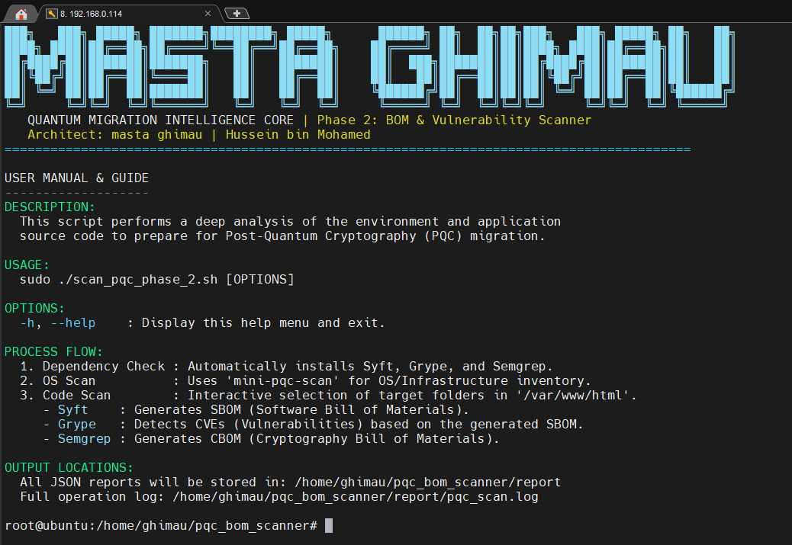
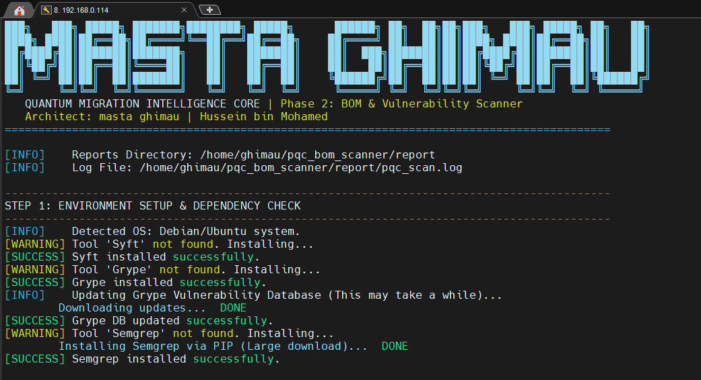
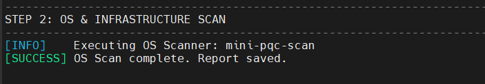
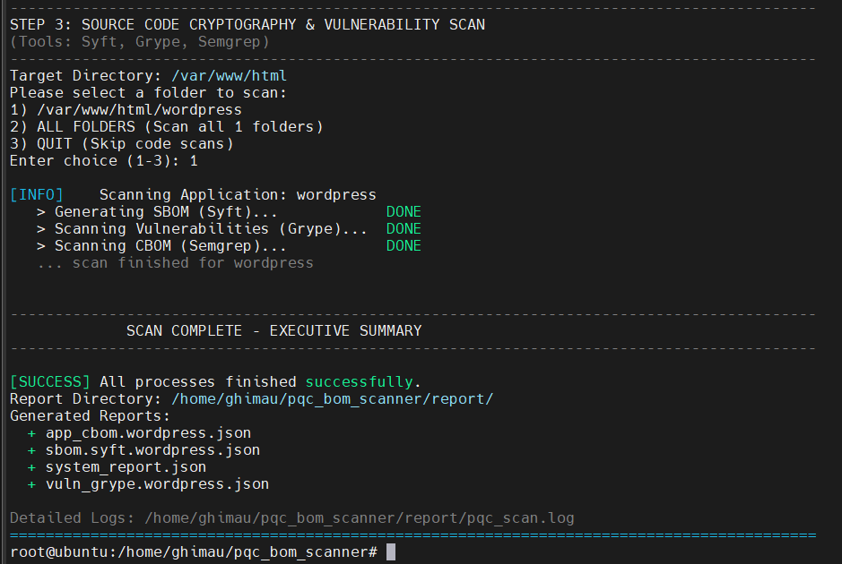

# 🛡️ Phase 2: Discovery & Inventory


> An "Inside-Out" scanner that generates Software Bill of Materials (SBOM) and Cryptographic Bill of Materials (CBOM) to identify internal PQC migration risks.

[⬅ Return to Main Page](../README.md)

## 📡 Introduction
While Phase 1 focused on what is visible from the network (**Outside-In**), Phase 2 focuses on the internal composition of your systems (**Inside-Out**).

Preparing for Post-Quantum Cryptography (PQC) isn't just about changing SSL certificates. It requires a deep understanding of the hidden dependencies and hardcoded logic within your applications. This phase helps you answer:

1. **What libraries are we running?** (Inventory/SBOM) 
2. **Are those libraries safe?** (Vulnerability Scan) 
3. **Where is the cryptography hidden in our code?** (CBOM)
4. **Is the Operating System itself crypto-agile?** (OS Scan)

---

## 🔄 The Methodology (How It Works)
Phase 2 uses a wrapper script (`pqc_scanner_phase2`) to automate four powerful scanning engines. It creates a comprehensive snapshot of your system's cryptographic health.

### **Step 1: The OS Layer Scan (Mini-PQC)** 
Before looking at the application code, the tool performs a specialized scan on the host operating system using the **`mini-pqc-scanner`** binary. 
* **Tool:** `mini-pqc-scanner`
*  **Target:** OS Kernel configuration, OpenSSL libraries, and System-wide crypto policies. 
*  **Goal:** To determine if the underlying server environment supports modern cryptographic primitives required for PQC (e.g., checking if the kernel supports newer ciphers or if OpenSSL is outdated). 
* **Output:** `system_report.json`

### **Step 2: SBOM Generation (The Inventory)** 
The tool uses **Syft** to inspect your application folders (e.g., `/var/www/html`). 
* **Tool:** `syft` 
* **What it does:** It creates a detailed list of every software package, library, and module installed (e.g., PHP Composer packages, Node.js modules). 
* **Why it matters:** You cannot migrate what you don't know you have. This list (SBOM) is the foundation for risk assessment. 

### **Step 3: Vulnerability Mapping (The Health Check)** 
⚠️ **Value-Add Feature:** 
This step is a proactive security enhancement added by the author and is **not** part of the original NACSA/PTPKM workbook scope. 
* **Tool:** `grype` 
* **What it does:** Matches your libraries against global CVE (Common Vulnerabilities and Exposures) databases. 
* **Why it matters:** Older, vulnerable libraries are often the hardest to migrate to PQC because they lack modern "Crypto-Agility". 

### **Step 4: CBOM Generation (The Code Analysis)** 
🛡️ **Core Function & Author's Contribution:**
 This step utilizes a **custom-developed ruleset** (`pqc-php-rules.yml`) developed by the author. It translates abstract PQC requirements into actionable code scanning rules.
 
* **Tool:** `semgrep` 
* **What it does:** It reads your source code line-by-line to find hardcoded cryptographic functions. 
* **Why it matters:** PQC migration is difficult if you have algorithms like MD5 or AES hardcoded directly in the source code. This scan pinpoints exactly where those lines are. 

---
### 🧠 Custom Rules: What are we detecting?

The CBOM scan is powered by a custom ruleset (`pqc-php-rules.yml`) **developed by Hussein bin Mohamed (masta ghimau)**.
> 🔄 **Continuous Improvement:** These rules are actively maintained and will be updated regularly to align with evolving PQC standards, cryptographic best practices, and new migration requirements.

### 📝 Supported Languages
The custom rules have been tailored to detect cryptographic violations in the following languages:
* **PHP** (Legacy & Modern frameworks)
* **JavaScript / Node.js** (Backend `crypto` module & `CryptoJS`)
* **TypeScript**

Here is a breakdown of the specific risks it hunts for:

| Category | Detected Patterns | Risk Explanation |
|---|---|---|
| **Weak Hashing** | `md5()`, `sha1()` | **High Risk.** These algorithms are broken and vulnerable to collision attacks. They must be replaced with PQC-safe hashes (e.g., SHA-3). |
| **Legacy Encryption** | `mcrypt`, `RC4`, `DES` | **High Risk.** Deprecated algorithms that are no longer secure. `mcrypt` is particularly dangerous as it was removed in modern PHP versions. |
| **Hardcoded Algorithms** | `openssl_encrypt(..., 'aes-128-cbc')` | **Medium Risk.** While AES is generally safe, hardcoding the string makes it hard to swap algorithms later. We want "Agile" code, not hardcoded strings. |
| **Password Hashing** | `password_hash(..., PASSWORD_BCRYPT)` | **Medium Risk.** Forcing `BCRYPT` (Blowfish) limits your ability to upgrade to memory-hard functions like Argon2id, which are more resilient against quantum attacks. |
| **Node.js Crypto** | `crypto.createHash('md5')` | **High Risk.** Specifically detects weak hashing implementations within Node.js or TypeScript environments. |
---

## 📈 Process Flowchart
```mermaid
graph TD
    start([Start Phase 2]) --> check_deps{Check Dependencies}
    
    check_deps -- Missing --> install_deps["Auto-Install Syft/Grype/Semgrep"]
    check_deps -- OK --> update_db["Update Grype Vuln DB\n(One-time init)"]
    install_deps --> update_db
    
    update_db --> os_scan["Step 1: Run Mini-PQC-Scanner\n(OS Level)"]
    
    os_scan --> select_target["User Selects Target Folder"]
    select_target --> loop_start{Loop Through Folders}
    
    loop_start --> step_sbom["Step 2: Run Syft\n(Generate SBOM)"]
    step_sbom --> step_vuln["Step 3: Run Grype\n(Map Vulnerabilities - No DB Update)"]
    step_vuln --> step_cbom["Step 4: Run Semgrep\n(Generate CBOM)"]
    
    step_cbom --> save_json[("Save JSON Reports\n(reports/ folder)")]
    save_json --> loop_check{More Folders?}
    
    loop_check -- Yes --> loop_start
    loop_check -- No --> list_files["List All Generated Files"]
    list_files --> finish([End Phase 2])
    
    style os_scan fill:#ffecb3,stroke:#e6b800,stroke-width:2px
    style step_cbom fill:#e1bee7,stroke:#8e24aa,stroke-width:2px
    style update_db fill:#b2dfdb,stroke:#00695c,stroke-width:2px,stroke-dasharray: 5 5
 ```
 
## 📊 Data Dictionary: Output Files

The scanner generates raw JSON files. These files are designed to be processed by the **Phase 3 Parser** to generate the following ready-to-use Excel files:

* `SBOM.xlsx`
* `CBOM.xlsx`
* `Risk_Register.xlsx`
* `Risk_Assessment.xlsx`

Below is the dictionary for the raw JSON outputs generated by the scanner:

| File Pattern | Engine | Description |
| :--- | :--- | :--- |
| `system_report.json` | **Mini-PQC** | Details on OS Kernel, OpenSSL version, and system-wide crypto policies. |
| `sbom.syft.*.json` | **Syft** | A complete inventory of all software packages and libraries found in the application folder. |
| `vuln_grype.*.json` | **Grype** | A list of CVEs matching the SBOM inventory. **Note:** Requires internet to update the CVE database. |
| `app_cbom.*.json` | **Semgrep** | **Critical.** Contains specific locations (file & line number) of cryptographic function calls in the source code. |

---
## 🚀 Deployment Workflow 

To avoid confusion, please observe where each tool is executed. The **Scanner** runs on the target server, while the **Parser** runs on your local workstation.

```mermaid
graph TD
    %% Nodes
    subgraph Local_Workstation ["💻 Local PC (Admin Workstation)"]
        A[Prepare Tools Folder]
        E[Run parser]
        F[Generate Excel Reports]
    end

    subgraph Target_Server ["🖥️ Target Server (The Asset)"]
        B[Upload Tools]
        C["Run ./pqc_scanner_phase2"]
        D[Generate JSON Results]
    end

    %% Edge Connections
    A -- "1. Upload Tools (SCP/SFTP)" --> B
    B --> C
    C --> D
    D -- "2. Download JSON (SCP/SFTP)" --> E
    E --> F

    %% Styling
    style Local_Workstation fill:#e3f2fd,stroke:#2196f3,stroke-width:2px
    style Target_Server fill:#ffebee,stroke:#f44336,stroke-width:2px
```
### 📝 Step-by-Step Deployment

1.  **Upload:** Copy the `tools/bom_analysis` folder from your **Local PC** to the **Target Server**.
2.  **Scan:** SSH into the **Target Server** and run `pqc_scanner_phase2`. This will generate raw `.json` files.
3.  **Download:** Copy the generated `.json` files back to your **Local PC**.
4.  **Parse:** Run the python parser on your **Local PC** to convert those JSON files into the final **Excel Reports**.

---

## 📂 Tools & Directory Structure

To run the scan, navigate to the `tools/bom_analysis` directory. The structure is organized as follows:

```text
tools/
└── bom_analysis/
    ├── pqc_scanner_phase2      # 🚀 The main executable scanner (Phase 2)
    ├── mini-pqc-scan           # 🛠️ OS-level binary (Kernel/OpenSSL scan)
    ├── pqc-php-rules.yml       # 📜 Custom Semgrep Rules by masta ghimau
    └── config/
        └── pqc.json            # ⚙️ Configuration settings for the scanner
```

## 🛠️ How to Use the Tool

### Prerequisites
- **Root privileges** (`sudo`) are required to install dependencies and scan system files.
- **Internet connection** is required on the first run to download the scanner binaries (Grype/Syft) and update the vulnerability database.

### 1. Basic Usage

Navigate to the tool directory and execute the scanner with root privileges.

```bash
cd tools/bom_analysis
sudo chmod +x pqc_scanner_phase2
sudo ./pqc_scanner_phase2
```

### 2. Interactive Menu
Once launched, the script will automatically detect subfolders in `/var/www/html` (default) or the path defined in `config/pqc.json`. You will be prompted to select a target:

```text
Select folder to scan:
1) /var/www/html/portal_v1
2) /var/www/html/api_service
3) ALL FOLDERS (Scan all folders)
4) QUIT
Enter choice (1-4):
```
---
## 📸 Screenshots & Proof of Concept

### 1. Running Help
The tool displays a clean banner and usage instructions upon execution.



*Figure 1: The main interface showing the version and author information.*

### 2. Step 1: Environment Setup & Dependency Check
The script automatically verifies if Syft, Grype, and Semgrep are installed.



*Figure 2: Auto-installation of dependencies. Note that the **Grype Vulnerability Database** is updated only during this initial phase to ensure the latest CVE data is used.*

### 3. Step 2: OS & Infrastructure Scan
Before touching the code, the system scans the underlying OS layer.



*Figure 3: Execution of the `mini-pqc-scanner` to capture Kernel configurations and OpenSSL library versions.*

### 4. Step 3: Source Code Cryptography & Vulnerability Scan
The deep analysis begins by generating the SBOM, creating the CBOM, and mapping vulnerabilities.



*Figure 4: The tool recursively scans the selected target directory (e.g., `/var/www/html`) and generates the raw JSON reports.*

### 🎥 Video Demo
See the Phase 2 scanner in action performing a deep dive analysis.

<video src="https://github.com/user-attachments/assets/2c0d6cf4-a895-4030-b85e-f9a7eff91e8f" controls="controls" style="max-width: 100%;">
</video>

### 📥 Download Sample Output

Want to see the data structure before scanning? Download the sample ZIP file below. It contains the raw **JSON reports** (OS, SBOM, CBOM, Vulnerability) generated by the scanner.

[**📄 Download Sample Output (ZIP)**](./sample/report.zip)

---

## ✅ Tested On

The tool has been verified and tested on the following environment:

```text
- Ubuntu 24.04.2 LTS
- Ubuntu 22.04 LTS
```
## 🔍 VirusTotal Scan Results

You can view the scan result for the compiled binary (`pqc_scanner_phase2`) here:

[**VirusTotal Report**](https://www.virustotal.com/gui/file/3d700714ad842b3cc9468e77b534e9996a9d15e5764f44b84b489c48ab3f0ef2?nocache=1)

## 📝 Todo List / Future Roadmap

- [ ] **Windows OS Support:** Develop native support for Windows environments.
- [ ] **Smart Path Detection:** Improve the scanner to trigger an **interactive prompt** if no source code is found in the default `/var/www` directory (currently defaults to scanning this specific path for PHP).
