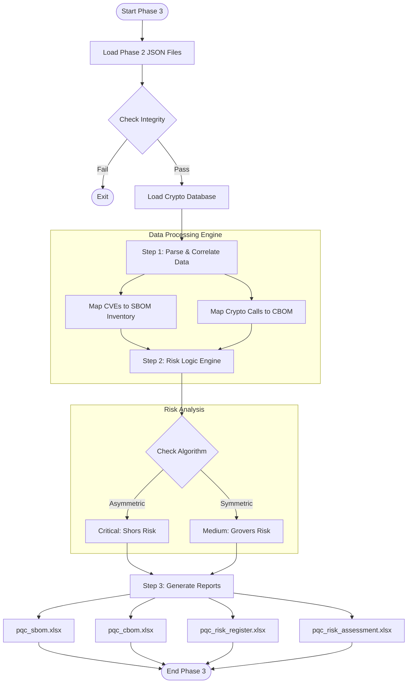

# 🧠 Phase 3: Intelligence & Reporting


> A post-processing engine that converts raw scan data into strategic PQC risk assessments and compliance reports.

[⬅ Return to Main Page](../README.md)

## 📡 Introduction
Phase 2 provided the raw inventory (Discovery). Phase 3 focuses on **Analysis**.

Raw data is often difficult for stakeholders to interpret. This phase uses the **PQC Parser** tool to process the scan results, identify cryptographic risks, and generate structured Excel reports. This ensures that both technical teams and management receive actionable information.

The parser automatically answers three key questions:
1.  **Which systems are vulnerable?** (Identifies assets using algorithms weak against quantum attacks).
2.  **What is the fix?** (Distinguishes between systems needing migration vs. simple key upgrades).
3.  **Who is responsible?** (Assigns ownership and risk levels for compliance tracking).

---

## 🔄 Methodology
The `pqc_parser.exe` tool is designed to automate the risk assessment process. It follows a structured four-step logic:

### **Step 1: Data Ingestion**
The tool reads the various JSON reports generated in Phase 2 (OS config, Software Inventory, and Code-level cryptography). It validates the files to ensure data integrity before processing.

### **Step 2: Threat Analysis**
The engine compares every detected algorithm against an internal **Cryptographic Database**. It categorizes risks based on two primary quantum threats:
* **Shor’s Algorithm:** Targets asymmetric encryption (e.g., RSA, ECC). These are flagged as **Critical** because they can be completely broken.
* **Grover’s Algorithm:** Targets symmetric encryption (e.g., AES-128). These are flagged as **Medium** because they are weakened but not broken (security is effectively halved).

### **Step 3: Risk Scoring**
A risk score is calculated for each finding using the standard formula:
$$Risk = Impact \times Likelihood$$
* **Impact:** Severity of the potential breach (e.g., Total Compromise vs. Weakened Security).
* **Likelihood:** Based on the prevalence of the algorithm in the codebase.

### **Step 4: Report Generation**
Finally, the tool generates formatted Excel files. It applies conditional formatting (e.g., highlighting critical items in **Red**) to help teams prioritize their remediation efforts.

---

## 🧠 Risk Scoring Model
The tool uses a defined **Risk Matrix** to classify findings. This ensures consistent reporting across all systems.

### 1. Impact Criteria
How severely does a quantum computer affect the algorithm?

| Score | Level | Description | Examples |
| :--- | :--- | :--- | :--- |
| **5** | **Critical** | **Broken.** The algorithm is no longer secure. Encrypted data can be decrypted. | RSA, DSA, Diffie-Hellman |
| **3** | **Moderate** | **Weakened.** The algorithm is less secure but still usable with larger keys. | AES-128, SHA-256 |
| **1** | **Low** | **Secure.** The algorithm is considered resistant to known quantum attacks. | AES-256, SHA-384 |

### 2. Risk Classification & Action
Based on the impact score, the tool assigns a risk level and a recommended action:

| Detected Algorithm | Risk Level | Action Required |
| :--- | :--- | :--- |
| **RSA, ECC, DH** | 🔴 **CRITICAL** | **Replace:** Migrate to Quantum-Resistant algorithms (e.g., ML-KEM). |
| **AES-128, MD5** | 🟡 **MEDIUM** | **Upgrade:** Increase key length (e.g., move to AES-256). |
| **AES-256** | 🟢 **LOW** | **Maintain:** Current implementation is sufficient. |

---

## 📈 Process Flowchart


---
## 📊 Output Artifacts

The PQC Parser generates four (4) targeted Excel reports. Each file is designed for a specific stakeholder, ensuring that the right information reaches the right team without overwhelming them.

| File Name | Target Audience | Content & Purpose |
| :--- | :--- | :--- |
| `pqc_sbom.xlsx` | **System Administrators** | **Software Inventory (SBOM).**<br>A comprehensive list of every software component detected, including OS Kernel versions, OpenSSL libraries, and application dependencies. It serves as the master inventory to answer: *"What exactly is running on our servers?"* |
| `pqc_cbom.xlsx` | **Developers** | **Cryptography Map (CBOM).**<br>A technical guide that maps cryptographic assets to source code. It pinpoints the exact **file path** and **line number** where specific algorithms (e.g., `AES-128`, `MD5`) are implemented, allowing developers to locate and fix issues quickly. |
| `pqc_risk_register.xlsx` | **Management / Audit** | **Executive Summary.**<br>A high-level governance document suitable for compliance audits. It lists identified risks, assigns a **Criticality Level** (High/Medium/Low), and defines the Risk Owner, helping management track PQC migration progress. |
| `pqc_risk_assessment.xlsx` | **Security Team** | **Deep Dive Analysis.**<br>The most detailed technical report. It includes the **Risk Score** (Impact × Likelihood), identifies the **Root Cause** (e.g., "Shor's Algorithm exposure"), and provides specific **Mitigation Plans** (e.g., "Migrate to ML-KEM" or "Increase Key Length"). |

---

# 📂 Data Dictionary: Output Artifacts

This document provides a detailed breakdown of the fields contained within the four (4) output reports generated by the **Quantum Migration Intelligence Core**.


## 1. 📄 SBOM Inventory (`pqc_sbom.xlsx`)
**Purpose:** A comprehensive inventory of Software, OS components, and Libraries.
**Automation Level:** Hybrid (Auto-filled by tool + Manual verification required).

| Field Name | Description | Source / Logic |
| :--- | :--- | :--- |
| **#** | Index number. | 🤖 **Auto** |
| **System / Application** | The name or IP address of the scanned server/application. | 🤖 **Auto** (From JSON metadata) |
| **Purpose / Usage** | The business function of this system (e.g., "HR Portal"). | 👤 **Manual** |
| **URL** | The web address of the system (if applicable). | 👤 **Manual** |
| **Services Mode** | Deployment type (e.g., Cloud, On-Premise, Hybrid). | 👤 **Manual** |
| **Target Customer** | Who uses this system (e.g., Public, Internal Staff). | 👤 **Manual** |
| **Software Component** | Detailed list of detected packages (OS Kernel, PHP versions, Libraries). | 🤖 **Auto** (Parsed from Syft/Mini-PQC) |
| **Vulnerability Status** | **[Value Added]** Current CVE status of the detected components. | 🤖 **Auto** (Parsed from Grype) |
| **Third-party Modules** | External libraries detected (e.g., OpenSSL, node_modules). | 🤖 **Auto** |
| **External APIs** | Connections to outside services (e.g., Payment Gateway). | 👤 **Manual** |
| **Critical Level** | Business criticality (Low/Medium/High/Critical). | 👤 **Manual** |
| **Data Category** | Type of data processed (e.g., Confidential, Official). | 👤 **Manual** |
| **Is in use?** | Active status of the system. | 👤 **Manual** |
| **Developer** | The team or company who built the system. | 👤 **Manual** |
| **Vendor's Name** | The organization responsible for the software (e.g., "Canonical", "The PHP Group"). | 🤖 **Auto** (Mapped via `VENDOR_MAP`) |
| **Expertise?** | Does the agency have internal skills to manage this? | 👤 **Manual** |
| **Budget?** | Is there budget allocated for migration? | 👤 **Manual** |
| **Link to CBOM** | Cross-reference ID linking to the Cryptography file. | 🤖 **Auto** |

> **✨ Value-Add Feature: Vulnerability Status**
> This field is **not part of the standard template**. It was added to provide a holistic security view. It allows you to see if a legacy component is not only Quantum-vulnerable but also currently exploitable (e.g., Log4j), helping to prioritize remediation.

> **⚠️ Important Note:**
> Fields marked as **Manual** are context-specific and cannot be scanned. These must be filled and verified by the **System Owner**.


## 2. 🔐 CBOM Cryptography (`pqc_cbom.xlsx`)
**Purpose:** A technical map connecting algorithms to their specific location in the codebase.
**Automation Level:** Fully Automated.

| Field Name | Description | Source / Logic |
| :--- | :--- | :--- |
| **# (CBOM)** | Unique ID for the cryptographic finding. | 🤖 **Auto** |
| **System / Application** | Name of the system being analyzed. | 🤖 **Auto** |
| **Cryptographic Function** | The type of operation (e.g., Encryption, Hashing, Signature). | 🤖 **Auto** (Derived from logic) |
| **Algorithm Used** | The specific primitive detected (e.g., `AES-128`, `RSA`, `MD5`). | 🤖 **Auto** |
| **Algorithm Category** | **[Value Added]** Classifies the algo as *Asymmetric*, *Symmetric*, or *Hash*. | 🤖 **Auto** (Mapped via `CRYPTO_MAP`) |
| **Library / Module** | The library providing the function (e.g., OpenSSL, Sodium). | 🤖 **Auto** |
| **File / Location** | **[Value Added]** Exact file path and line number of the code. | 🤖 **Auto** (Parsed from Semgrep) |
| **Key Length** | The bit-strength of the key used. | 🤖 **Auto** |
| **Purpose / Usage** | How the crypto is used (e.g., "App Logic", "System Security"). | 🤖 **Auto** |
| **Crypto-Agility Support** | Readiness for PQC migration. | 🤖 **Auto** |

### 🔍 Field Logic & Rationale

**1. Algorithm Category (Custom Field)**
* **Rationale:** The standard template lists algorithms but doesn't categorize them. We added this because **Shor's Algorithm** and **Grover's Algorithm** attack categories differently. This field allows the Risk Engine to apply the correct risk logic automatically.

**2. File / Location (Custom Field)**
* **Rationale:** Knowing *that* you use MD5 is useless if you don't know *where* it is. This field provides the exact path (e.g., `/var/www/html/login.php`) so developers can find and fix the code immediately.

**3. Key Length: "Variable"**
* **Meaning:** The scan detected the algorithm (e.g., RSA) but the specific key size (1024 vs 2048) is determined at runtime or configuration, not hardcoded.
* **Implication:** Manual verification is needed to confirm the configuration settings.

**4. Crypto-Agility Support Logic**
* The script checks if the algorithm is a recognized NIST PQC standard (e.g., `ML-KEM`).
* **Logic:** `If algo name contains "ml-" (Module-Lattice) -> "Yes (PQC)". Else -> "Low (Classical)".`


## 3. 🚨 Risk Register (`pqc_risk_register.xlsx`)
**Purpose:** High-level risk tracking for management and compliance.
**Automation Level:** Fully Automated.

| Field Name | Description | Logic / Hardcoded Value |
| :--- | :--- | :--- |
| **#** | Risk ID. | 🤖 **Auto** |
| **Nama Sistem** | System Name. | 🤖 **Auto** |
| **Jenis Aset** | Asset Type (OS vs Code). | 🤖 **Auto** (`if "[OS]" in module else "Application Code"`) |
| **Algoritma Kriptografi** | The vulnerable algorithm. | 🤖 **Auto** |
| **Kegunaan** | Usage (Encryption/Hashing). | 🤖 **Auto** |
| **Tahap Kritikal** | Criticality Rating. | 🤖 **Logic:** If Asymmetric = **"Kritikal"**, Else = **"Tinggi"**. |
| **Risiko** | Risk Description. | 🤖 **Logic:** `PQC Vulnerability: [Risk Desc]` |
| **Pemilik Risiko** | Person responsible. | 🤖 **Default:** "IT Security Team" |

---

## 4. 🛡️ Risk Assessment (`pqc_risk_assessment.xlsx`)
**Purpose:** Detailed technical risk scoring and mitigation planning.
**Automation Level:** Fully Automated.

| Field Name | Description | Logic / Hardcoded Value |
| :--- | :--- | :--- |
| **Nama Sistem** | System Name. | 🤖 **Auto** |
| **Algoritma Kriptografi** | The detected algorithm. | 🤖 **Auto** |
| **Risiko** | The specific Quantum Threat. | 🤖 **Logic:** "Exposure to Shor's/Grover's Algorithm". |
| **Punca Risiko** | Root Cause. | 🤖 **Logic:** "Usage of [Category] algorithm which is not quantum-resistant". |
| **Impak** | Impact Score (1-5). | 🤖 **Logic:** See Scoring Model below. |
| **Kemungkinan** | Likelihood Score (1-5). | 🤖 **Logic:** See Scoring Model below. |
| **Skor Risiko** | Total Risk Score. | 🤖 **Calc:** `Impak` x `Kemungkinan`. |
| **Risk Level** | Qualitative Level. | 🤖 **Logic:** See Scoring Model below. |
| **Kawalan Sedia Ada** | Existing Controls. | 🤖 **Default:** "Standard IT Security Controls". |
| **Mitigation Plan** | Recommended Fix. | 🤖 **Logic:** See Mitigation Logic below. |

### 🧮 Risk Scoring Model (Algorithm)

The parser uses a hardcoded logic engine to calculate risk based on the **Algorithm Category** found in the `CRYPTO_MAP`.

#### 1. Impact & Likelihood Logic
| Category | Threat | Impact | Likelihood | Calculation |
| :--- | :--- | :--- | :--- | :--- |
| **Asymmetric** (RSA, ECC) | **Shor's Algorithm** (Total Break) | **5** (Catastrophic) | **5** (Certainty) | 5 x 5 = **25** |
| **Symmetric** (AES-128) | **Grover's Algorithm** (Weakened) | **3** (Moderate) | **3** (Probable) | 3 x 3 = **9** |

#### 2. Risk Level Logic
| Score | Risk Level | Logic in Script |
| :--- | :--- | :--- |
| **25** | **Sangat Tinggi** (Very High) | `if "Asymmetric" in category` |
| **9** | **Sederhana** (Medium) | `if "Symmetric" in category` |
| **< 9** | **Rendah** (Low) | `else` |

#### 3. Mitigation Plan Logic
* **If Asymmetric:** The tool outputs: *"Migrate to NIST PQC Standards (ML-KEM/ML-DSA)"*.
* **If Symmetric:** The tool outputs: *"Double Key Length / Digest Size (e.g., AES-128 -> AES-256)"*.
---

## 🚀 Deployment Architecture

Unlike Phase 2 (Scanning), Phase 3 is a **post-processing activity**. It is designed to run securely on the Analyst's workstation to prevent performance impact on the production server.

### Workflow Overview
The process follows a "Scan-Download-Analyze" model:

1.  **Scan:** Data is collected on the Target Server (Phase 2).
2.  **Transfer:** JSON files are moved to a secure Analyst Workstation.
3.  **Analyze:** The PQC Parser processes the data locally to generate reports.

```mermaid
graph TD
    %% Nodes
    subgraph Server ["🖥️ Target Server (Production)"]
        A[Phase 2 Scans Completed]
        B[JSON Output Files]
    end

    subgraph Laptop ["💻 Analyst Workstation (Secure)"]
        C[Download JSON Files]
        D[Run pqc_parser.exe]
        E[Final Excel Reports]
    end

    %% Flow
    A --> B
    B -- "Secure Transfer (SCP/SFTP)" --> C
    C --> D
    D --> E

    %% Styling
    style Server fill:#ffebee,stroke:#ef5350,stroke-width:2px
    style Laptop fill:#e3f2fd,stroke:#2196f3,stroke-width:2px
    ```

